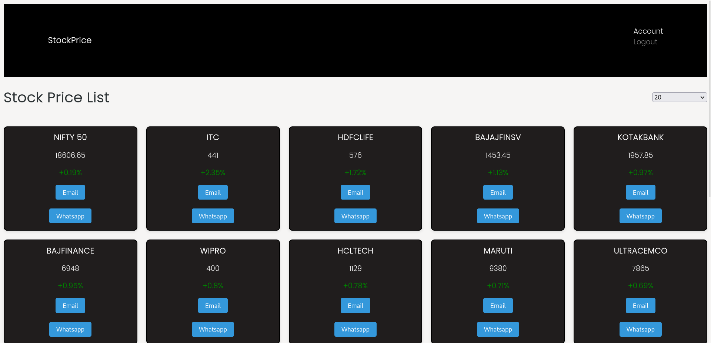

# giga-growth-ventures-assignment

Develop a basic webapp using MERN stack wherein a user can share the latest sales number with his/her boss by email or whatsapp.

1. Create a login using Google authentication.
2. Once the user logs in, they need to see a dashboard wherein they can fetch the stock price for the given stock on the 15th of May is **\_\_\_**(use any publicly traded stock price from NSE or BSE using any freely available API )
3. The user can share that information with their boss (another user) by email or whatsapp with the message "The stock price on the 15th of May is **\_\_\_**".
4. Implement logout functionality.

You just need to share a video screen record of the app with clear explanation in your own voice how you implemented each part.

# Login


# HomePage



## Technologies Used

- **React.js** for the frontend user interface
- **Node.js** and Express.js for the backend server
- **MongoDB** for the database
- **React Router** for routing
- **JSON Web Tokens (JWT)** for user authentication

## Getting Started

To rund the App locally on your machine, follow these steps:

1. Clone the repository:

   ```shell
   git clone https://github.com/aslezar/giga-growth-ventures-assignment
   ```

2. Navigate to the project directory:

   ```shell
   cd giga-growth-ventures-assignment/server
   ```

3. Install the dependencies for the backend:

   ```shell
   npm install
   ```

4. Install the dependencies for the frontend:

   ```shell
   cd ../client
   npm install
   ```

5. Make a `.env` and update the configuration values with your own:

   - Set the `PORT` PORT number to start server on
   - Set the `MONGO_URI` to your MongoDB connection string
   - Set the `JWT_SECRET` to a secret key for JWT authentication
   - Set the `JWT_LIFETIME` JWT liftime

6. Start the backend server:

   ```shell
   npm run server
   ```

7. Start the frontend development server:

   ```shell
   npm run client
   ```

8. Access the App in your web browser at `http://localhost:3000`.
